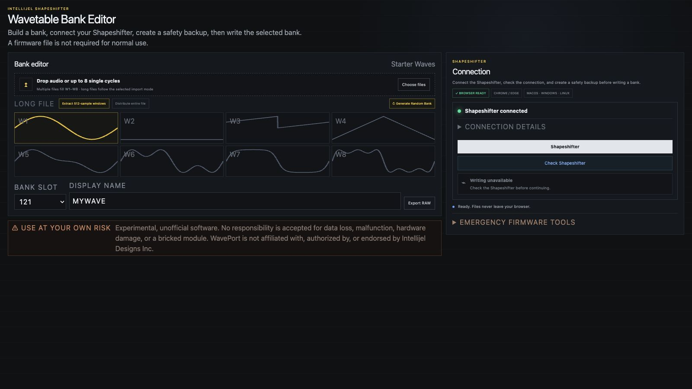

# Shapeshifter Wavetable Bank Editor

[**Open the Shapeshifter Wavetable Bank Editor**](https://mardlib.github.io/shapeshifter-wavetable-editor/)

**Current version: 0.2.3** · [Release notes](RELEASE_NOTES.md) · [All GitHub releases](https://github.com/mardlib/shapeshifter-wavetable-editor/releases)

### What changed in 0.2.3

- Firmware installation is disabled while exact compatibility with the official
  Quartus JIC programming process is being verified.
- Complete read-only flash backups and exact full-flash recovery remain available.



A browser-based tool for creating and writing custom wavetable banks to an
Intellijel Shapeshifter through its USB service connection. The normal workflow
does not require a firmware image or a platform-specific application.

> [!WARNING]
> This is experimental, unofficial software. Using it can cause data loss,
> malfunction, hardware damage, or a bricked module. Use it entirely at your
> own risk, keep a verified backup, and provide stable power while writing.
>
> This project is not affiliated with, authorized by, or endorsed by Intellijel
> Designs Inc.

## Features

- Import one audio file, up to eight single-cycle WAV files, or drag a file onto
  an individual wave slot.
- Extract consecutive 512-sample waves or distribute a longer recording across
  a bank.
- Generate a varied but related random set with moving formants, phase warping,
  drive, and wave folding across its eight waves.
- Preview all eight waves and choose any of the 128 bank slots.
- Connect to the Shapeshifter from Chrome or Edge on macOS, Windows, or Linux.
- Install WavePort as an app and use it without an internet connection.
- Create one downloadable safety-backup file for the selected bank.
- Restore a downloaded bank backup in a later session without changing the
  other seven banks stored in the same flash sector.
- Write and verify the selected bank, with automatic in-session rollback if a
  write check fails.
- Create a verified complete read-only flash backup.
- Load a saved full-flash dump for exact byte-for-byte recovery.

All audio conversion and bank processing happens locally in the browser.
No files are uploaded by the application.

## Requirements

- Intellijel Shapeshifter
- Compatible USB service/programming connection
- Desktop Chrome or Edge with WebUSB support
- A data-capable USB cable

Safari and Firefox do not currently expose the WebUSB API required by this
tool.

## Install for offline use

Open the hosted WavePort page once in desktop Chrome or Edge, then choose the
browser's **Install WavePort** action. The installed app opens in its own window
and keeps the complete interface and Shapeshifter USB bridge available offline.

An internet connection is only needed for the initial installation and to
receive future updates. USB access and all audio processing remain local.

## Normal workflow

1. Import or generate a bank.
2. Select the destination bank and display name.
3. Connect the Shapeshifter.
4. Check the Shapeshifter connection.
5. Create and download the safety backup.
6. Confirm the destination bank and write it.
7. Let the write and verification finish without disconnecting power or USB.

The downloadable `.backup` file contains the original bank-name data and the
complete eight-bank flash block containing the selected bank. Keep it until the
new bank has been tested. To restore it later, verify the Shapeshifter, choose
**Restore a downloaded bank backup**, load the file, and enter the displayed
confirmation phrase. The restore process copies only the bank and name recorded
in the file, verifies both, and leaves neighboring banks unchanged.

## Full-flash backup and recovery

Firmware installation from JIC files is disabled. WavePort's earlier sparse-JIC
method was hardware-tested on one module, but it has not been proven equivalent
to the official Quartus programming process across firmware and hardware versions.
Use the official Quartus Programmer for firmware updates.

The collapsed recovery section can still detect the fitted EPCS16 or EPCS64,
read the complete physical flash twice, and save the matching dump without making
changes. A selected full-flash backup can later be restored and verified against
that same backup byte-for-byte. It preserves the exact recorded state, including
wavetables, presets, calibration, firmware, and every other byte in the dump.

## Local development

Requires Node.js 22.13 or newer.

```bash
npm install
npm run dev
```

Open the local address printed by the development server.

Useful checks:

```bash
npm run lint
npm test
npm run build:pages
```

`npm run build:pages` creates the static GitHub Pages site in `dist-pages/`.

## GitHub Pages

The current static build is published from the `gh-pages` branch:

https://mardlib.github.io/shapeshifter-wavetable-editor/

To publish an updated build, run `npm run build:pages` and deploy the contents
of `dist-pages/` to that branch.

WebUSB requires a secure context; the HTTPS URL provided by GitHub Pages meets
that browser requirement.

## Credits

The USB programming and SPI-over-JTAG implementation is adapted from
[openFPGALoader](https://github.com/trabucayre/openFPGALoader), licensed under
Apache License 2.0. The included volatile FPGA bridge and attribution details
are documented in [THIRD_PARTY_NOTICES.md](THIRD_PARTY_NOTICES.md).

## License

WavePort's original source code is released under the [MIT License](LICENSE).
Bundled third-party material remains under its respective license.
